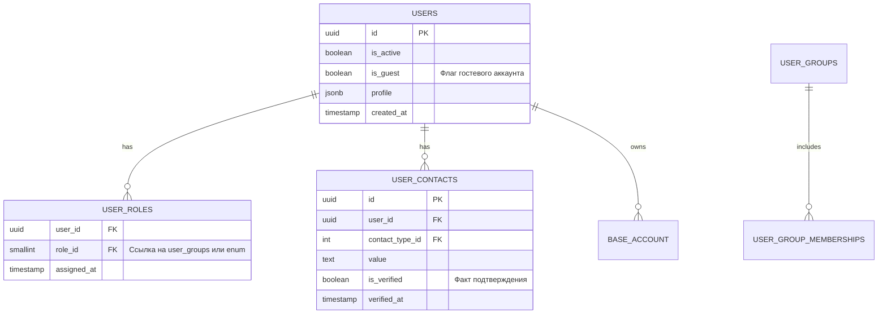
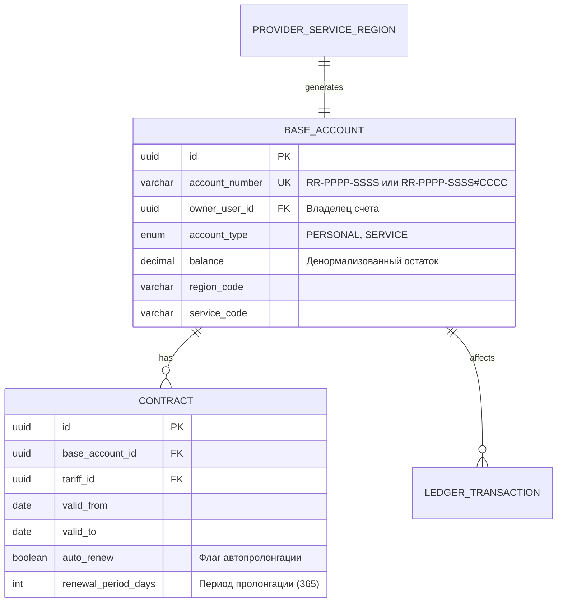

📦 Пакет Артефактов: Рефакторинг Auth & Users Core (pay_services)

**Версия:** 1.0  
**Дата:** 2026-09-17  
**Автор:** Системный Аналитик (Orchestrator)  
**Статус:** Готов к реализации

## 0. Введение и Контекст

Данный пакет описывает целевую архитектуру (TO BE) для подсистемы идентификации пользователей и бухгалтерского учета лицевых счетов (Ledger). Цель — устранить разрыв между бизнес-логикой (мерчанты, иерархия счетов, договоры) и текущей реализацией БД.

### Ключевые изменения (AS IS → TO BE)

| Компонент         | AS IS (Текущее)                | TO BE (Целевое)                                        | Обоснование                                                               |
| :---------------- | :----------------------------- | :----------------------------------------------------- | :------------------------------------------------------------------------ |
| **Роли**          | Жесткие группы (`user_groups`) | M:N связь `user_roles` + Бизнес-роли                   | Поддержка мультирольности (Поставщик+Плательщик) без дублирования записей |
| **Лицевые счета** | Отсутствуют / Разрознены       | Единая схема `core.base_account` с генератором номеров | Фундамент финтех-учета, поддержка префиксов поставщиков                   |
| **Внешние ID**    | Разбросаны по схемам банков    | Единая таблица `common.mappings`                       | Централизация маппинга для вебхуков и поиска                              |
| **Гости**         | Не сохраняются                 | Записи в `users` с флагом `is_guest`                   | История транзакций, возможность конвертации в плательщика                 |
| **Договоры**      | Есть таблица, нет логики       | `contracts` + `tariffs` с историей НДС и пролонгацией  | Автоматизация тарификации и уведомлений                                   |

---

## 1. Протокол анализа методом трёх цветов 🔴🟡🟢

_Методология: Выявление фактов, неопределённостей и противоречий на основе интервью._

### 🟢 Зелёный: Подтверждённые факты

1.  **Лицевой счет (ЛС)** — основная сущность учета. Каждый пользователь при регистрации получает личный баланс. Сервисные ЛС создаются при добавлении услуги/региона.
2.  **Формат номера ЛС**:
    - Поставщик: `RR-PPPP-SSSS` (Регион-Поставщик-Услуга).
    - Плательщик: `RR-PPPP-SSSS#CCCC` (Префикс поставщика + код клиента).
3.  **Мультирольность**: Один `users.id` может иметь роли «Поставщик» и «Плательщик» одновременно.
4.  **Верификация**: Для Поставщиков обязательна (Email/SMS). Для Плательщиков — гибрид (Email приоритетно, SMS fallback). Гости верификацию не проходят.
5.  **Внешние ID**: Хранятся только в отдельной таблице/маппинге. Привязка к платежным сервисам — исключительное право админа.
6.  **Договоры**: Привязаны к ЛС поставщика. Требуются справочники НДС с историей и логика автопролонгации (+1 год при отсутствии уведомления за 10 дней до конца).
7.  **Интеграции**: Таблица `common.mappings` используется для связи внутренних UUID с внешними ID банков.

### 🟡 Жёлтый: Требует уточнения (TBD)

1.  **Y-01**: Максимальная длина компонентов номера ЛС (`region_code`, `service_code`, `customer_suffix`) для выбора типа данных в БД?
2.  **Y-02**: Требуется ли физическое удаление геолокации/персональных данных гостей после N дней неактивности (ФЗ-152)?
3.  **Y-03**: Какой именно формат разделителя в номере ЛС утвержден окончательно (`-` или `_`)? В требованиях упоминались оба.
4.  **Y-04**: Нужен ли отдельный статус «На модерации» для саморегистрированных поставщиков перед выдачей им права создавать сервисные ЛС?

### 🔴 Красный: Противоречия и риски

1.  **C-01**: _INN как идентификатор vs Информационное поле._ Ранее предполагалась связь через INN, но подтверждено, что INN необязательно и может быть у плательщиков. **Решение**: Связь User ↔ BaseAccount осуществляется строго через `owner_user_id` (UUID), INN остается опциональным атрибутом профиля.
2.  **C-02**: _Обязательность ЛС для всех ролей._ Админам/менеджерам ЛС не нужны, но отсутствие связи может привести к ошибкам в триггерах. **Решение**: Поле `owner_user_id` в `base_account` сделать `NOT NULL`, но генерировать технические ЛС для сотрудников только при необходимости (или использовать отдельную таблицу `employee_accounts`).
3.  **C-03**: _Конкурентность баланса._ Риск race condition при параллельных операциях. **Решение**: Использовать Stored Procedures с `SELECT ... FOR UPDATE` и атомарными обновлениями. ORM запрещен для операций с балансом.

---

## 2. Модель данных TO BE (Logical ERD)

### 2.1. Схема `accounts` (Пользователи и Роли)

### 2.2. Схема `core` (Лицевые счета и Ledger)

### 2.3. Схема `common` (Маппинги и Справочники)

- **`mappings`**: `internal_id` (UUID), `external_system` (enum: ALPHA, 2CAN), `external_id` (text), `mapping_data` (jsonb), `valid_from/to`.
- **`tax_rates`**: `id`, `rate_value` (decimal), `type` (PRINCIPAL, AGENT), `valid_from`, `valid_to`.

---

## 3. Бизнес-логика: Генератор Лицевых Счетов

_Описание в формате КОГДА-ЕСЛИ-ТОГДА-ИНАЧЕ (стандарт учебного курса)._

**Триггер:** Создание новой услуги поставщиком ИЛИ привязка нового плательщика к услуге.

**КОГДА:** Система получает запрос на создание сервисного лицевого счета.

**ЕСЛИ:**

1.  Указан валидный `region_code` (справочник регионов).
2.  Указан валидный `service_code` (справочник услуг).
3.  Владелец счета (`owner_user_id`) имеет роль «Поставщик».
4.  Для плательщика: указан уникальный `customer_suffix` в рамках данного сервисного ЛС.

**ТОГДА:**

1.  Сформировать номер:
    - Для поставщика: `{region_code}-{provider_prefix}-{service_code}`
    - Для плательщика: `{provider_ls_number}#{customer_suffix}`
2.  Проверить уникальность номера в `core.base_account`.
3.  Создать запись в `core.base_account` с типом `SERVICE`.
4.  Если это первый сервисный ЛС поставщика — автоматически создать связанный `CONTRACT` со статусом `DRAFT`.
5.  Вернуть созданный объект ЛС.

**ИНАЧЕ ЕСЛИ:** Номер уже существует.

- Вернуть ошибку `ACCOUNT_NUMBER_EXISTS`.

**ИНАЧЕ ЕСЛИ:** Владелец не является поставщиком.

- Вернуть ошибку `INSUFFICIENT_PRIVILEGES`.

---

## 4. State Machine: Жизненный цикл Лицевого Счета

| Статус    | Описание                                 | Разрешённые переходы   | Триггер перехода                         |
| :-------- | :--------------------------------------- | :--------------------- | :--------------------------------------- |
| `ACTIVE`  | Счет активен, операции разрешены         | → `FROZEN`, → `CLOSED` | Ручная блокировка / Закрытие договора    |
| `FROZEN`  | Операции приостановлены (спор, проверка) | → `ACTIVE`, → `CLOSED` | Решение админа / Урегулирование спора    |
| `CLOSED`  | Финальный статус, архив                  | —                      | Истечение срока + отсутствие пролонгации |
| `PENDING` | Счет создан, но контракт не подписан     | → `ACTIVE`, → `CLOSED` | Подписание договора / Отказ              |

---

## 5. CRUD-матрица с пояснениями

_Проверка согласованности модели данных и сценариев._

| Сценарий               | users              | user_roles        | base_account    | contracts          | mappings                                                  | Пояснение |
| :--------------------- | :----------------- | :---------------- | :-------------- | :----------------- | :-------------------------------------------------------- | :-------- |
| Регистрация Поставщика | C                  | C (role=PROVIDER) | C (Personal LS) | —                  | При создании юзера сразу генерируется личный баланс       |
| Добавление Услуги      | R                  | R                 | C (Service LS)  | C (Draft Contract) | Генерация сервисного ЛС и черновика договора              |
| Привязка Банка         | R                  | R                 | R               | U                  | Запись внешнего ID в `mappings`, обновление метаданных ЛС |
| Гостевой Платеж        | C (is_guest=true)  | C (role=GUEST)    | R/U (Target LS) | R                  | Создание гостя, чтение баланса получателя, транзакция     |
| Конвертация Гостя      | U (is_guest=false) | U (role=PAYER)    | R               | —                  | Смена флага, назначение роли, сохранение истории          |
| Автопролонгация        | —                  | —                 | R               | U (valid_to+)      | Cron-job проверяет контракты, обновляет дату окончания    |

---

## 6. Спецификация Интеграций (Банки/ПС)

### Интеграция I-1: Маппинг внешних идентификаторов

- **Назначение:** Связь внутренних UUID пользователей/счетов с ID в системах Альфа-Банка, 2can и др. для обработки вебхуков.
- **Хранилище:** Таблица `common.mappings`.
- **Ключевые поля:** `external_system` (enum), `external_id` (indexed), `internal_id` (uuid), `mapping_data` (jsonb для доп. параметров терминала).
- **Правила:**
  - Один `internal_id` может иметь несколько `external_id` для разных систем.
  - Поиск по `external_id` должен быть мгновенным (индекс B-Tree).
  - Изменение маппинга требует аудита (кто и когда изменил).

### Интеграция I-2: Уведомления о договоре

- **Тип:** Асинхронная (через RabbitMQ/Redis).
- **Триггер:** Ежедневный cron-job за 10 дней до `valid_to`.
- **Логика:**
  - Если `auto_renew = true` И нет записи о расторжении → отправить email поставщику → продлить `valid_to` на 365 дней.
  - Если `auto_renew = false` → просто уведомить об окончании.
- **Retry:** Экспоненциальная задержка (1ч, 4ч, 24ч) при недоступности почтового шлюза.

---

## 7. Реестр требований (MoSCoW)

| ID   | Тип         | Формулировка                                                                 | Приоритет | Статус            |
| :--- | :---------- | :--------------------------------------------------------------------------- | :-------- | :---------------- |
| R-01 | Запрос      | Система должна генерировать номера ЛС по шаблону `RR-PPPP-SSSS` и `...#CCCC` | Must      | Принято           |
| R-02 | Запрос      | Баланс ЛС должен обновляться атомарно через Stored Procedure                 | Must      | Принято           |
| R-03 | Запрос      | Поддержка мультирольности через M:N таблицу `user_roles`                     | Must      | Принято           |
| R-04 | Запрос      | Внешние ID банков хранятся в `common.mappings`                               | Must      | Принято           |
| R-05 | Запрос      | Автопролонгация договоров при отсутствии уведомления о расторжении           | Should    | Принято           |
| R-06 | Ограничение | INN не используется как ключ связи User-Account                              | Must      | Принято           |
| R-07 | Открытый    | Максимальная длина компонентов номера ЛС?                                    | TBD       | Требует уточнения |
| R-08 | Открытый    | Формат разделителя в номере ЛС (`-` или `_`)?                                | TBD       | Требует уточнения |

---

## 8. Инструкция для агентов Cline/Roo Code

> **ВАЖНО:** При реализации используй следующие правила. Нарушение правил = брак.

1.  **DB First:** Все изменения БД только через миграции в `sql/schemas/{service}/tables/`. Никаких прямых ALTER в коде.
2.  **No ORM for Ledger:** Операции с `base_account.balance` ТОЛЬКО через SQL Stored Procedures. AsyncPG напрямую.
3.  **Validation:** Контакты в Pydantic-схемах всегда `dict` (не null). Группы всегда `list`.
4.  **Bank Names:** Всегда отображать как `АО 'АЛЬФА-БАНК'`. Валюта только RUB.
5.  **Datetime:** ISO 8601 с timezone везде.
6.  **Idempotency:** Миграции и бизнес-операции должны быть идемпотентными.
7.  **Testing:** После реализации каждого эндпоина/SP запускать smoke-test.

### Задачи для исполнения (Backlog)

1.  [ ] Создать миграцию для таблицы `user_roles` и перенести данные из `user_group_memberships`.
2.  [ ] Добавить поле `is_guest` в `users` и флаг `is_verified` в `user_contacts`.
3.  [ ] Реализовать Stored Procedure `generate_ledger_account` по спецификации из раздела 3.
4.  [ ] Обновить Pydantic-схемы `UserReadExtended` и `BaseAccountCreate`.
5.  [ ] Написать тест на конкурентное списание баланса (race condition check).

---

## 9. Аналитические выводы и обоснование решений

1.  **Почему M:N для ролей?** Текущая модель с одной группой на пользователя не позволяет водителю такси быть одновременно плательщиком за парковку и поставщиком услуг для пассажиров. M:N решает это без дублирования профилей.
2.  **Почему хранимые процедуры для баланса?** Python-ORM не гарантирует атомарность на уровне СУБД при высокой нагрузке. Только SP с `FOR UPDATE` обеспечивает целостность средств. Это критично для финтеха.
3.  **Почему `common.mappings` вместо отдельных таблиц?** Унифицирует обработку вебхуков. Вебхук-сервису не нужно знать о структуре каждой банковской схемы — он работает с единым интерфейсом маппингов.
4.  **Риски:** Основная опасность — сложность миграции существующих данных. Рекомендуется провести dry-run миграции на копии prod-базы перед деплоем.

---
